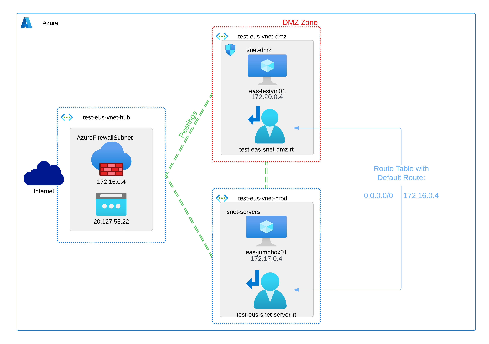
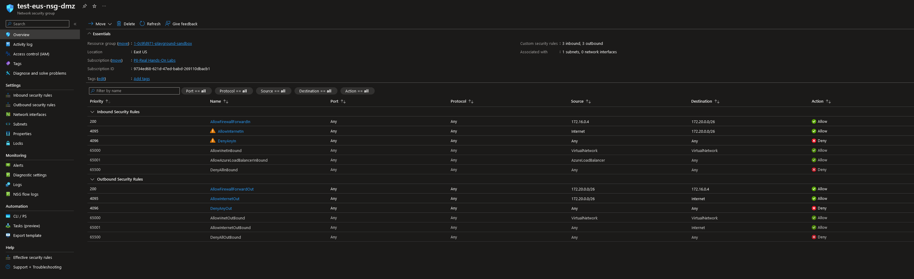
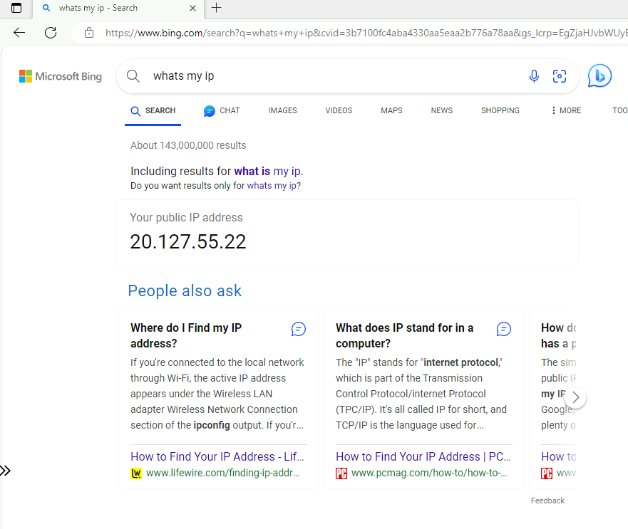
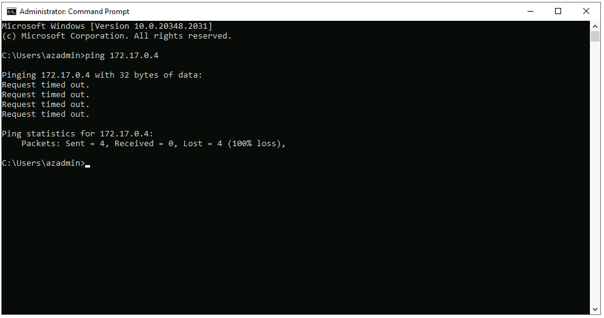
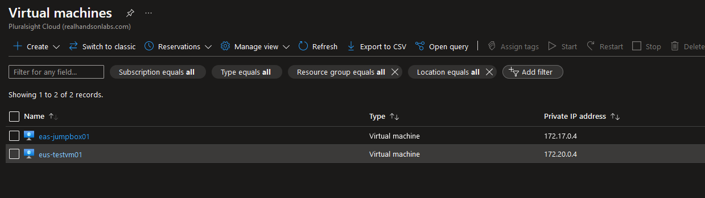
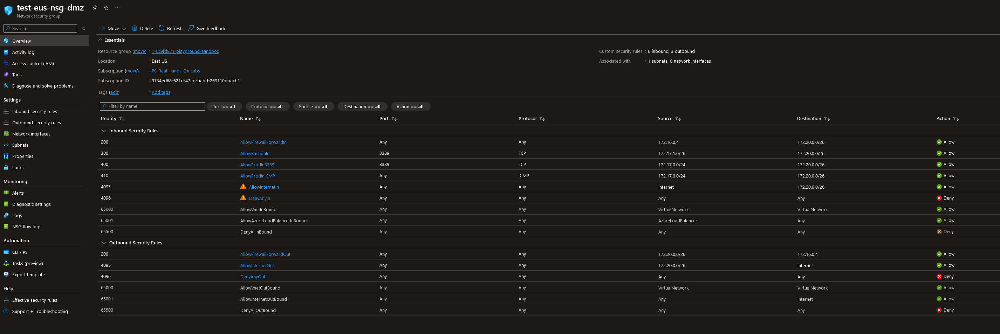
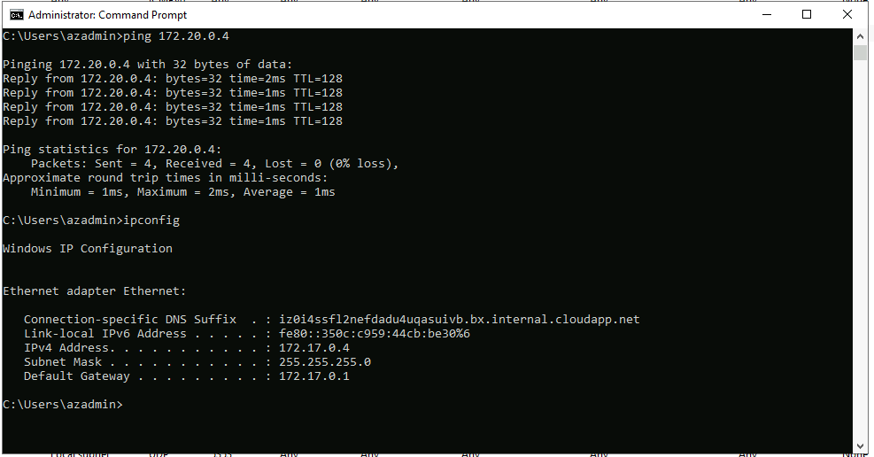
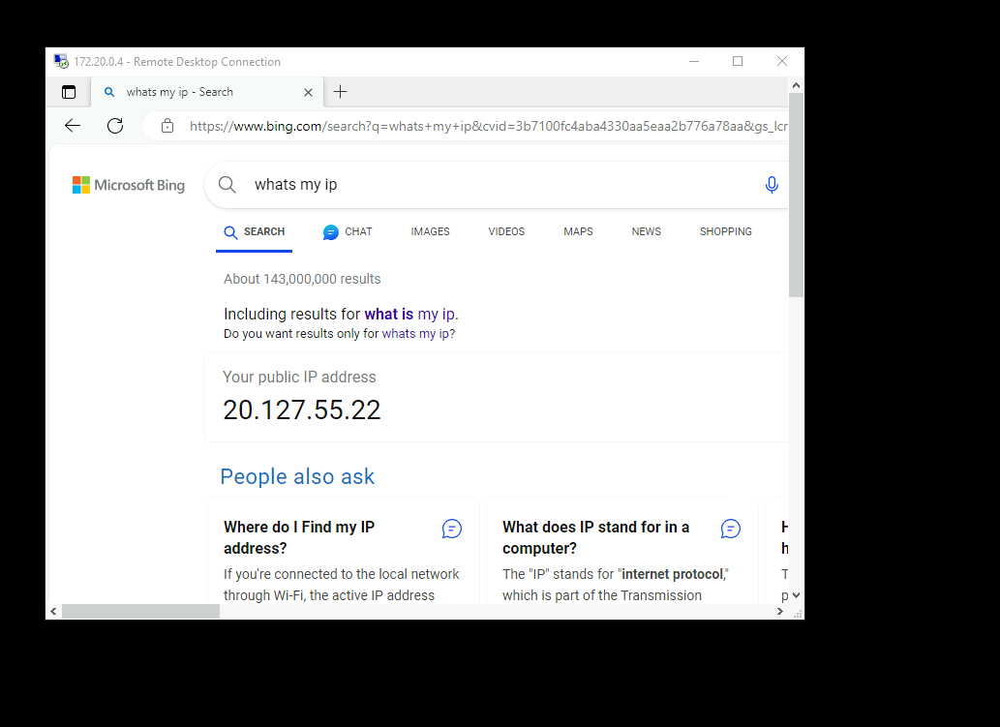
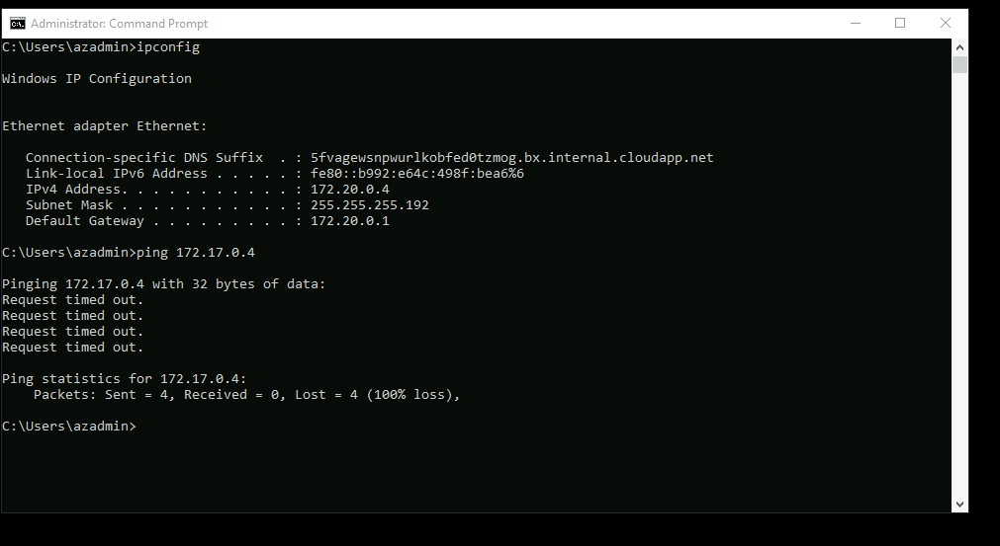

A DMZ in the Context of Explicit Internet Access

When designing and building enterprise-level environments, I often grapple with determining the "right" approach for certain tasks. Recently, one of these areas has been the implementation of a Demilitarized Zone (DMZ) within an environment that leverages Azure Firewall or Network Virtual Appliances (NVAs).

The conventional method might involve creating a route table that directs all peered traffic between virtual networks to the Firewall for inspection. This approach allows for the creation of various rulesets to disallow traffic, effectively establishing a DMZ. However, it can also introduce management complexities and leave room for potential rule chain errors. In this article, we will delve into the advantages of utilizing an Azure NSG as a DMZ within a virtual network in an enterprise-level environment featuring Firewall appliances.

Azure Network Security Groups (NSGs) provide a no-cost solution for establishing and managing a DMZ within an enterprise virtual network. Since the NSG sits on the subnet as its own logical access control mechanism, it provides a higher level of granularity while being less prone to rule changes on the firewall potentially poking holes in the DMZ. This not only enhances security but also offers a host of benefits. 

This specific example explores how an NSG can be effectively utilized as a DMZ within an Azure Firewall/NVA environment. However, it's worth noting that this concept can be adapted to work in a similar fashion with a NAT gateway or load balancer for external outbound internet traffic mechanisms.

What is a DMZ?

A DMZ is a network segment that acts as an intermediary between the internal network (trusted zone) and the external network (untrusted zone). It serves as a buffer, allowing controlled communication between these two zones while safeguarding sensitive resources. In traditional setups, a physical DMZ involves multiple layers of firewall systems and intricate configurations.

The Benefits of Azure NSGs as a DMZ

Enhanced Network Segmentation:
Azure NSGs empower organizations to establish a logical DMZ, facilitating improved network segmentation. By defining and applying rules to NSGs, administrators can exercise precise control over traffic flow between various network segments within the environment. This level of granularity enhances network security by reducing the attack surface.

Rule-Based Access Control:
Azure NSGs operate based on rule sets, granting administrators the ability to specify which traffic is permitted and which is blocked. This rule-based access control is highly customizable, enabling fine-grained control over network traffic. Administrators can define source and destination, ports, protocols, and service tags to create comprehensive security policies.

Monitoring and Logging:
Azure NSGs offer robust monitoring and logging capabilities. By leveraging these features, organizations can gain valuable insights into network traffic, promptly detect anomalies, and investigate security incidents. For a DMZ NSG, this capability is particularly valuable, as it allows the creation of alert rules based on specific traffic behavior within the DMZ. These alerts can be designated as high-priority, providing advanced warning in case a threat actor attempts to gain access to the network through a less secure DMZ resource.

//Visualizing the DMZ//

What would a DMZ within an NSG look like from a high level view?

For the purpose of this demp, we've interconnected all virtual networks through peering, effectively forming a mesh network.

So now we know the architecture, here's what our baseline rule set would look like.

- IP 172.16.0.4 represents the Private IP of the Azure Firewall.

- The 172.20.0.0/26 subnet is designated as the DMZ.

- We have two rulesets: one for general traffic to reach the firewall and another for allowing "internet" tagged traffic to pass through the firewall. These rules collectively enable internet connectivity from a resource in the DMZ subnet.

- The "DenyAll" rule on both inbound and outbound flows of this NSG restricts all traffic except internet-bound traffic.

We observe that "testvm01" can reach the internet using the Firewall's public IP:

However, it cannot ping "jumpbox01" in the production vNet:

Suppose we want "jumpbox01" in the production network to ping and RDP into "testvm01" in the DMZ. Here are the VMs and their IPs again:

We will add two rules: one for RDP connectivity from the production network and another for ICMP connectivity from the same production network into the DMZ subnet. The "Bastion" rule enables our initial connectivity to "testvm01" for this demo.

With these rules in place, we can now ping "testvm01" from "jumpbox01" in the production virtual network:

Additionally, we can RDP into "testvm01":

However, attempting to ping from the DMZ back into the production virtual network remains unsuccessful:

Conclusion

In this environment, we've effectively established a DMZ subnet, ensuring that an unsecured resource can access the internet through an Azure Firewall, NVA, NAT Gateway, or Load Balancer while still allowing resources in other virtual networks to interact with it through a single direction.

By leveraging Azure NSGs as a DMZ, enterprises can enhance their network security, mitigate risks, and ensure the confidentiality, integrity, and availability of their valuable assets. As cyber threats continue to evolve, adopting solutions like Azure NSGs is a proactive step toward safeguarding the digital infrastructure of the enterprise.
